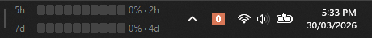

[](https://opensource.org/licenses/MIT)

# Claude Code Usage Monitor

> This is a fork of [CodeZeno/Claude-Code-Usage-Monitor](https://github.com/CodeZeno/Claude-Code-Usage-Monitor).
> The bars are coloured by how fast you are burning the window rather than by the
> raw percentage, a third bar tracks the per-model weekly limit, hovering shows
> each limit's exact reset time, and the widget stays put on multi-monitor
> machines across session locks. All of it is configurable from the settings
> file. Everything else is upstream's work.



A lightweight Windows taskbar widget for people already using Claude Code, with optional Codex and Google Antigravity usage display.

It sits in your taskbar and shows how much of your Claude Code, Codex, and/or Antigravity usage window you have left, without needing to open the terminal or the provider site.

## What You Get

- A **5h** bar for your current 5-hour Claude usage window
- A **7d** bar for your current 7-day window
- A third bar for the **per-model weekly limit**, labelled with whatever model the API reports it against
- Hovering the widget shows each limit's **exact reset time**, in your Windows regional format, where the bars only have room for a countdown
- The widget stays on one screen: it no longer wanders to another monitor when the session is locked or reattached over RDP
- Bars coloured by **consumption pace** instead of raw percentage, so 40% used with four hours left reads differently from 40% used with twenty minutes left
- Optional Codex usage bars alongside Claude Code
- Optional Antigravity model usage bars for Google's 5-hour and weekly Gemini quota windows
- A live countdown until each limit resets
- A small native widget that lives directly in the Windows taskbar
- System tray icon badges showing your enabled model usage percentage
- Left-click the tray icon to toggle the taskbar widget on or off
- Right-click options for refresh, displayed models, update frequency, language, startup, widget visibility, and updates
- Multi-monitor taskbar placement, so the widget can live on the taskbar for the screen you prefer

## Who This Is For

This app is for Windows users who already have **Claude Code (CLI or App) installed and signed in**.

Codex support is optional. To show Codex usage, install and sign in to the Codex CLI, then enable Codex from the right-click **Models** menu.

Antigravity support is optional too. To show Antigravity usage, install and sign in to Google Antigravity, then enable the **Antigravity** model from the right-click **Models** menu.

It works best if you want a simple "how close am I to the limit?" display that is always visible.

## Requirements

- Windows 10 or Windows 11
- Claude Code (CLI or App) installed and authenticated
- Optional: Codex CLI installed and authenticated, if you want Codex usage
- Optional: Google Antigravity installed and authenticated, if you want Antigravity usage

If you use Claude Code through WSL, that is supported too. The monitor can read your Claude Code credentials from Windows or from your WSL environment.

## Install

Download the latest `claude-code-usage-monitor.exe` from the [Releases](https://github.com/hadufer/Claude-Code-Usage-Monitor/releases) page and run it. Nothing else to install.

A WinGet package is [waiting for review](https://github.com/microsoft/winget-pkgs/pull/408338). Once it is merged, this will work:

```powershell
winget install hadufer.ClaudeCodeUsageMonitor
```

Until then that command reports `No package found matching input criteria`, because the identifier does not exist in the catalogue yet.

The upstream package, `CodeZeno.ClaudeCodeUsageMonitor`, is a different one. Both
provide the same `claude-code-usage-monitor` command, so uninstall one before
installing the other.

## Use

If you installed with WinGet, run:

```powershell
claude-code-usage-monitor
```

If you downloaded the release directly, run the executable itself — the `claude-code-usage-monitor` command only exists once WinGet has created its shim.

Once running, it will appear in your taskbar and as one or more tray icons in the notification area.

- Drag the left divider to move the taskbar widget
- On multi-monitor setups, drag the widget onto another Windows taskbar to move it to that screen
- Right-click the taskbar widget or tray icon for refresh, displayed models, update frequency, Start with Windows, reset position, language, updates, and exit
- Left-click the tray icon to toggle the taskbar widget on or off
- Enable `Start with Windows` from the right-click menu if you want it to launch automatically when you sign in

### Models

Use the right-click **Models** menu to choose what the widget displays:

- **Claude Code** is enabled by default
- **Codex** can be enabled alongside Claude Code or shown by itself
- **Antigravity** can be enabled alongside the other providers or shown by itself as its own model column

When multiple models are shown, each model has its own usage bar and matching usage text color. Antigravity prefers Google's Gemini quota summary when available and falls back to model quota data when needed.

### System Tray Icon

The tray icon shows your current 5-hour usage as a percentage badge.

If multiple providers are enabled, the app shows one tray icon per provider. If only one model is enabled, it shows one tray icon.

The Claude Code tray icon uses the same pace colours as the Claude bars, with the badge number switching to a dark ink on the light amber band so it stays readable. The Codex tray icon uses a black and white badge style. The Antigravity tray icon uses a blue badge style.

Hovering over a tray icon shows the usage values for that model.

## Pace Colours

A bar coloured by raw percentage cannot tell you whether you are in trouble: 40%
spent means one thing four hours before the reset and another twenty minutes
before it. So each bar is coloured by pace instead, on the same scale the Claude
Code statusline uses:

```text
pace = percentage * window / elapsed
```

100 means you are exactly on track to reach the limit at the reset. Below 85 is
green, 85 to 115 amber, above that brick red.

Elapsed time is clamped to a tenth of the window. Without that floor, spending
one percent two minutes after a reset divides by almost nothing and paints the
bar red for no reason. The clamp keeps the warning where it belongs: burning 40%
of the window in its first twenty minutes still reads red, because it should.

The three bands differ in lightness as well as hue. That is deliberate — three
equally light traffic-light colours collapse into each other under the common
forms of colour blindness, and the bars are only thirteen pixels tall.

Turn the whole thing off from the right-click **Settings** menu to get upstream's
flat brand-coloured bars back. Note that pace answers "am I burning too fast for
the time left", not "am I nearly out": near the end of a window pace converges on
the raw percentage, so a bar that is 95% spent an hour before its reset reads
amber rather than red.

## Per-Model Weekly Bar

Anthropic reports a separate weekly allowance for some models. The API does not
expose it as its own field: it appears inside the response's `limits` array as a
`weekly_scoped` entry, carrying the model it applies to. The third bar reads it
from there and takes its label from the model name the API gives, so a rename on
Anthropic's side follows through instead of leaving a stale label behind.

The bar only appears once the API has actually reported such a limit. Because a
third row has to fit the taskbar height Windows allows, the rows close up while
it is shown and the label column widens to hold a model name. Toggle it from the
right-click **Settings** menu.

One limitation: this data only exists in the usage endpoint's response. When the
app falls back to reading rate-limit headers from the Messages API, the row stays
but its value shows `--`, because dropping the row would reflow the whole widget
over a single incomplete poll. It keeps the last label it saw, so the row does not
disappear on its own once a scoped limit has been reported at least once — untick
it in the **Settings** menu if the limit stops applying to you.

## Settings File

Two toggles live in the right-click **Settings** menu. The thresholds and colours
are file-only, because a Windows context menu is a poor place to type a hex code.

| Key | Default | Meaning |
| --- | --- | --- |
| `pace_colors` | `true` | Colour by pace instead of raw percentage |
| `show_scoped_weekly` | `true` | Show the per-model weekly bar |
| `pace_on_track` | `85` | Below this pace, the bar is green |
| `pace_at_risk` | `115` | Below this, amber; at or above, red |
| `pace_min_elapsed_fraction` | `0.1` | Floor on elapsed time, as a fraction of the window |
| `pace_color_on_track` | `#3F9142` | |
| `pace_color_at_risk` | `#E8A33C` | |
| `pace_color_over` | `#C4402F` | |
| `pin_to_primary_taskbar` | `true` on a fresh install | Keep the widget on the monitor Windows reports as primary. Dragging the widget onto another taskbar turns it off; dragging it back turns it on. An upgrade from a version without this key keeps whatever screen you had already chosen. |

Values are validated when read. An unparsable colour or a threshold pair that
would leave a band unreachable falls back to its default rather than taking the
app down with it. Saving rewrites the file in place, so values you tuned by hand
survive a menu click.

## Diagnostics

If you need to troubleshoot startup or visibility issues, run:

```powershell
claude-code-usage-monitor --diagnose
```

This writes a log file to:

```text
%TEMP%\claude-code-usage-monitor.log
```

With diagnostics on, that log includes the raw body of the usage response, which
is how the per-model weekly limit was found in the first place. It holds usage
percentages and reset times, never a token, and the file is rewritten on every
run. Diagnostics are off unless you pass the flag.

Settings are saved to:

```text
%APPDATA%\ClaudeCodeUsageMonitor\settings.json
```

## Account Support

This app works with the same account types that Claude Code itself supports.

As of **March 19, 2026**, Anthropic's Claude Code setup documentation says:

- **Supported:** Pro, Max, Teams, Enterprise, and Console accounts
- **Not supported:** the free Claude.ai plan

If Anthropic changes Claude Code availability in the future, this app should follow whatever Claude Code supports, as long as the usage data remains exposed through the same authenticated endpoints.

## Privacy And Security

This project is **open source**, so you can inspect exactly what it does.

What the app reads:

- Your local Claude Code OAuth credentials from `~/.claude/.credentials.json`
- If needed, the same credentials file inside an installed WSL distro
- If Codex is enabled, your local Codex credentials from `$CODEX_HOME/auth.json` or `~/.codex/auth.json`
- If Antigravity is enabled, your local Antigravity OAuth token from Windows Credential Manager target `gemini:antigravity`

What the app sends over the network:

- Requests to Anthropic's Claude endpoints to read your usage and rate-limit information
- Requests to ChatGPT's Codex usage endpoint to read your Codex usage and rate-limit information, if Codex is enabled
- Requests to Google's Cloud Code / Antigravity endpoints to read your Antigravity quota information, if Antigravity is enabled
- Requests to GitHub only if you use the app's update check / self-update feature
- If proxy environment variables such as `HTTPS_PROXY`, `HTTP_PROXY`, or `ALL_PROXY` are set, those outbound requests may use that proxy

What the app stores locally:

- Widget position
- Selected taskbar / screen
- Widget visibility
- Polling frequency
- Language preference
- Last update check time
- Displayed model preferences
- Pace colouring preferences: the two toggles, the thresholds, the elapsed floor and the three band colours

What it does **not** do:

- It does not send your credentials to any other server
- It does not use a separate backend service
- It does not collect analytics or telemetry
- It does not upload your project files
- It does not directly edit your Codex credentials file

Notes:

- If your Claude Code token is expired, the app may ask the local Claude CLI to refresh it in the background
- If your Codex token is expired, the app may ask the local Codex CLI to refresh it in the background. The monitor does not write `auth.json` itself; any credential update is handled by the Codex CLI.
- If your Antigravity token is expired, open Antigravity and sign in again. The monitor does not write Windows Credential Manager entries itself.
- Portable installs can update themselves by downloading the latest release from this repository
- Proxies should be trusted because proxied usage requests include your OAuth bearer token inside the TLS connection

## How It Works

The monitor:

1. Finds your enabled model login credentials
2. Reads your current usage from Anthropic, ChatGPT, and/or Google's Antigravity endpoints
3. Shows the result directly in the Windows taskbar
4. Keeps the widget aligned with the selected taskbar and tray area
5. Refreshes periodically in the background

If the newer usage endpoint is unavailable, it can fall back to reading the rate-limit headers returned by Claude's Messages API.

## Open Source

This project is licensed under MIT.

If you want to inspect the behavior or audit the code, everything is in this repository.
