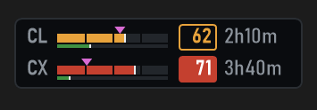
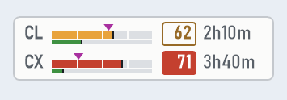
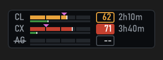
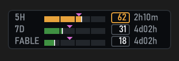
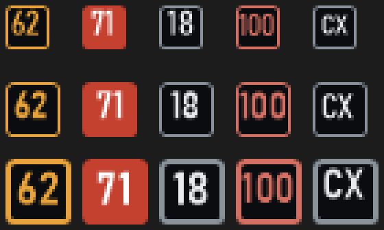
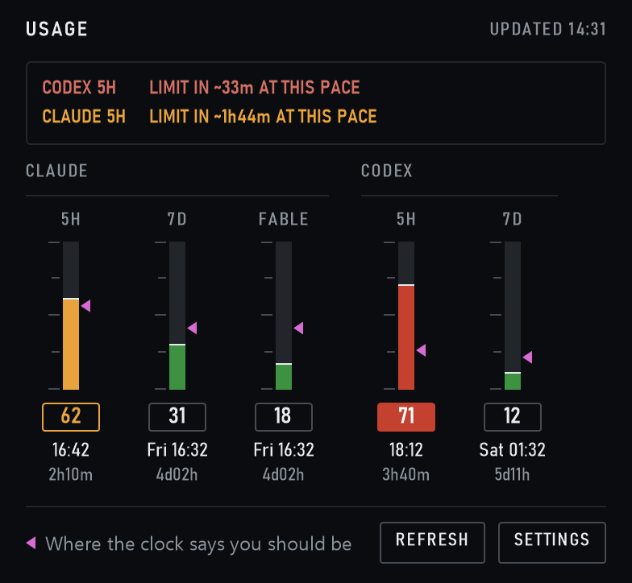

[](https://opensource.org/licenses/MIT)

# AI Usage Monitor

&nbsp;&nbsp;

<sub>Rendered by the app's own drawing code, with example values. The widget follows the Windows dark or light setting, unless you pick one under **Settings > Theme**.</sub>

A lightweight Windows taskbar widget for people already using Claude Code, with optional Codex and Google Antigravity usage display.

It sits in your taskbar and shows how much of your Claude Code, Codex, and/or Antigravity usage window you have left, without needing to open the terminal or the provider site.

## What You Get

- One row per provider: its **5h** tape, a hairline for its **7d** window under it, the percentage in a box and the countdown to the reset
- With a single provider, one row per window instead: **5h**, **7d**, and the **per-model weekly limit**, labelled with whatever model the API reports it against
- A magenta marker on every tape showing **where the clock says you should be**: when the fill runs past it you are burning ahead of the window
- Tapes coloured by **consumption pace** instead of raw percentage, so 40% used with four hours left reads differently from 40% used with twenty minutes left
- Click the widget for the **usage panel**: every limit of every provider, its **exact reset time** in your Windows regional format, and a warning when the limit would land before the reset at the current rate
- The widget stays on one screen: it does not wander to another monitor when the session is locked or reattached over RDP
- Optional Codex usage bars alongside Claude Code
- Optional Antigravity model usage bars for Google's 5-hour and weekly Gemini quota windows
- A live countdown until each limit resets
- A small native widget that lives directly in the Windows taskbar
- System tray icon badges showing your enabled model usage percentage
- Left-click the tray icon to toggle the taskbar widget on or off
- Right-click options for refresh, displayed models, update frequency, language, theme, startup, widget visibility, and updates
- Multi-monitor taskbar placement, so the widget can live on the taskbar for the screen you prefer

## Who This Is For

This app is for Windows users who already have **Claude Code (CLI or App) installed and signed in**.

Codex support is optional. To show Codex usage, install and sign in to the Codex CLI, then enable Codex from the right-click **Models** menu.

Antigravity support is optional too. To show Antigravity usage, install and sign in to Google Antigravity, then enable the **Antigravity** model from the right-click **Models** menu.

It works best if you want a simple "how close am I to the limit?" display that is always visible.

## Requirements

- Windows 10 or Windows 11
- Claude Code (CLI or App) installed and authenticated
- Optional: Codex CLI installed and authenticated, if you want Codex usage
- Optional: Google Antigravity installed and authenticated, if you want Antigravity usage

If you use Claude Code through WSL, that is supported too. The monitor can read your Claude Code credentials from Windows or from your WSL environment.

## Install

```powershell
winget install hadufer.ClaudeCodeUsageMonitor
```

That is the recommended way: it installs under your own profile, so it never asks for administrator rights, and `winget upgrade` keeps it current. If WinGet reports `No package found matching input criteria`, run `winget source update` first — your index is older than the package.

If you would rather not use WinGet, download **`claude-code-usage-monitor-setup.exe`** from the [Releases](https://github.com/hadufer/ai-usage-monitor/releases) page and run it. It gives you the same per-user install: a Start Menu entry, an uninstaller in Add/Remove Programs, and optionally the command on your `PATH`. Or take `claude-code-usage-monitor.exe` from the same page, which runs on its own with nothing installed.

All of them are built by CI from the tagged commit. None are code-signed, so Windows SmartScreen will warn you the first time you run a downloaded exe: choose **More info** then **Run anyway**, or check the SHA256 against the release notes if you prefer.

The installer takes the usual silent switches, if you are deploying it:

```powershell
claude-code-usage-monitor-setup.exe /SILENT /NORESTART
```

## Use

The installer puts a **Claude Code Usage Monitor** entry in your Start Menu, so
that is the shortest way in. If you let it add the app to your `PATH`, or if you
installed with WinGet, this works from any new terminal:

```powershell
claude-code-usage-monitor
```

With the portable exe, run the file itself: the bare command only exists once
something has put the directory on your `PATH`. Nothing prints to the terminal
either way — it is a GUI app, it returns immediately and appears in the taskbar.

Only one copy runs at a time. Launching it again while it is already running does
nothing at all, by design, and reports no error.

Once running, it will appear in your taskbar and as one or more tray icons in the notification area.

- Click the widget to open the usage panel; click it again, press Escape or click anywhere else to close it
- Drag the widget to move it along the taskbar
- On multi-monitor setups, drag the widget onto another Windows taskbar to move it to that screen
- Right-click the taskbar widget or tray icon for refresh, displayed models, update frequency, Start with Windows, reset position, language, updates, and exit
- Left-click the tray icon to toggle the taskbar widget on or off
- Enable `Start with Windows` from the right-click menu if you want it to launch automatically when you sign in

### Models

Use the right-click **Models** menu to choose what the widget displays:

- **Claude Code** is enabled by default
- **Codex** can be enabled alongside Claude Code or shown by itself
- **Antigravity** can be enabled alongside the other providers or shown by itself as its own model column

When multiple models are shown, each gets its own row, marked with a two-letter code: `CL` for Claude, `CX` for Codex, `AG` for Antigravity. Antigravity prefers Google's Gemini quota summary when available and falls back to model quota data when needed.

&nbsp;&nbsp;

A provider that could not be read has its code struck through and reads `--`. With Claude shown alone, the widget gives each of its windows a row instead (right).

Providers are listed in one table (`src/providers.rs`) that decides their order, their menu entry and their tray icon, so the widget is not wired to a fixed set of them. Adding one means adding a table entry, a poller arm, and the few remaining per-provider arms (state storage, row formatting, tray badge colours); the drawing code itself is generic and needs no change.

A row is only filled in when that provider actually reported that window. OpenAI's windows are told apart by their length rather than by the key they arrived under: the 5-hour and weekly limits are recognised from `limit_window_seconds`, because `primary_window` and `secondary_window` are positional names and the server has been seen delivering the weekly window as `primary_window`. A row nobody reported reads `--` instead of an invented `0%`, for every provider rather than for OpenAI alone.

### System Tray Icon

The tray icon shows your current 5-hour usage as a percentage badge.

If multiple providers are enabled, the app shows one tray icon per provider. If only one model is enabled, it shows one tray icon.

Each badge is the widget's boxed 5-hour value at icon size: outlined in amber or red when that window is ahead of its pace, and filled red for the one value most over it. Before the first answer the badge shows the provider's code instead, and the Claude one shows the app icon.



<sub>The badges at the 100%, 125% and 150% icon sizes, magnified four times.</sub>

Hovering over a tray icon shows the usage values for that model.

### The Usage Panel



The widget only has room for a countdown, so a click opens a panel with every
limit of every provider shown: a tape per window, its value, the wall-clock time
it resets at and the time left. Times follow your Windows regional format, with
the weekday in front when the reset is not today. The conversion goes through
your time zone rather than shifting by a fixed offset, so a reset on the far side
of a daylight-saving change still reads correctly.

When a window is being spent fast enough that the limit would arrive before the
reset, the panel says so at the top, with how long is left at the current rate.
Its **Refresh** button polls immediately and **Settings** opens the same menu as a
right-click. The panel follows the Windows light or dark setting, like the widget.

## Which Screen It Lives On

By default the widget stays on the monitor Windows reports as primary. That
sounds obvious, but the shell makes it harder than it looks: locking the session
on a machine that can also be used over RDP tears the taskbars down and rebuilds
them, and for a few seconds the primary flag can sit on another monitor or on
none at all. The widget is therefore pinned to an identity Windows maintains
itself rather than to a position in a list, it waits for that screen to exist
before choosing at startup, and a background check moves it back if it ever ends
up elsewhere.

Drag the widget onto another taskbar and the pin turns off — a screen you picked
on purpose is respected, and drift correction stops for it. Drag it back onto the
primary and the pin comes back on. Upgrading from a version that predates the
setting keeps whatever screen you had already chosen rather than yanking the
widget to the primary.

If your primary monitor has no taskbar at all, the widget goes wherever it can
and says so in the diagnostic log. That one is the shell's problem, not the app's,
and restarting Windows Explorer fixes it.

## Pace Colours

A bar coloured by raw percentage cannot tell you whether you are in trouble: 40%
spent means one thing four hours before the reset and another twenty minutes
before it. So each bar is coloured by pace instead, on the same scale the Claude
Code statusline uses:

```text
pace = percentage * window / elapsed
```

100 means you are exactly on track to reach the limit at the reset. Below 85 is
green, 85 to 115 amber, above that brick red.

Elapsed time is clamped to a tenth of the window. Without that floor, spending
one percent two minutes after a reset divides by almost nothing and paints the
bar red for no reason. The clamp keeps the warning where it belongs: burning 40%
of the window in its first twenty minutes still reads red, because it should.

The three bands differ in lightness as well as hue. That is deliberate — three
equally light traffic-light colours collapse into each other under the common
forms of colour blindness, and the tapes are only a few pixels tall.

The magenta marker on each tape draws the same formula: it sits at the share of
the window that has gone by, with the same floor on elapsed time, so the fill
divided by the marker is the pace. Fill short of the marker is green, level with
it amber, well past it red.

Turn the colouring off from the right-click **Settings** menu to get plain,
uncoloured tapes; the marker stays, since the time it shows is still true. Note that pace answers "am I burning too fast for
the time left", not "am I nearly out": near the end of a window pace converges on
the raw percentage, so a bar that is 95% spent an hour before its reset reads
amber rather than red.

## Per-Model Weekly Bar

Anthropic reports a separate weekly allowance for some models. The API does not
expose it as its own field: it appears inside the response's `limits` array as a
`weekly_scoped` entry, carrying the model it applies to. The per-model tape reads
it from there and takes its label from the model name the API gives, so a rename
on Anthropic's side follows through instead of leaving a stale label behind.

It only appears once the API has actually reported such a limit. It always has
its column in the usage panel; in the widget it gets a row of its own when Claude
is the only provider shown, the rows closing up to fit a third one into the
taskbar's height. With several providers the widget keeps one row each, and the
per-model limit lives in the panel. Toggle it from the right-click **Settings**
menu.

One limitation: this data only exists in the usage endpoint's response. When the
app falls back to reading rate-limit headers from the Messages API, the row stays
but its value shows `--`, because dropping the row would reflow the whole widget
over a single incomplete poll. It keeps the last label it saw, so the row does not
disappear on its own once a scoped limit has been reported at least once — untick
it in the **Settings** menu if the limit stops applying to you.

## Settings File

A few toggles live in the right-click **Settings** menu. The thresholds and colours
are file-only, because a Windows context menu is a poor place to type a hex code.

| Key | Default | Meaning |
| --- | --- | --- |
| `pace_colors` | `true` | Colour by pace instead of raw percentage |
| `show_scoped_weekly` | `true` | Show the per-model weekly tape |
| `detailed_time` | `false` | Show hours *and* minutes (`3h59m`) instead of the nearest hour (`4h`). Widens the widget. Also in the **Settings** menu |
| `pace_on_track` | `85` | Below this pace, the tape is green |
| `pace_at_risk` | `115` | Below this, amber; at or above, red |
| `pace_min_elapsed_fraction` | `0.1` | Floor on elapsed time, as a fraction of the window |
| `pace_color_on_track` | `#3F9142` | |
| `pace_color_at_risk` | `#E8A33C` | |
| `pace_color_over` | `#C4402F` | |
| `auto_install_updates` | `true` | Install an available update without asking. Also in the **Settings** menu |
| `update_check_interval_hours` | `24` | How often to look, clamped to 1 hour at the fastest |
| `pin_to_primary_taskbar` | `true` on a fresh install | Keep the widget on the monitor Windows reports as primary. Dragging the widget onto another taskbar turns it off; dragging it back turns it on. An upgrade from a version without this key keeps whatever screen you had already chosen. |

Values are validated when read. An unparsable colour or a threshold pair that
would leave a band unreachable falls back to its default rather than taking the
app down with it. Saving rewrites the file in place, so values you tuned by hand
survive a menu click.

## Diagnostics

If you need to troubleshoot startup or visibility issues, run:

```powershell
claude-code-usage-monitor --diagnose
```

This writes a log file to:

```text
%TEMP%\claude-code-usage-monitor.log
```

With diagnostics on, that log includes the raw body of the usage responses, which
is how the per-model weekly limit was found in the first place and how the
OpenAI window shape gets checked against a real account. It holds usage
percentages, reset times and, on a ChatGPT workspace plan, the account id —
never a token. The file is rewritten on every run. Diagnostics are off unless
you pass the flag.

It also records the decisions that are otherwise invisible: which taskbar was
chosen and whether it was matched by monitor or fallen back to by index, whether
the background check moved the widget, how long startup waited for the primary
screen, and whether the settings file failed to parse. Those exist because each
one of them once failed silently.

Settings are saved to:

```text
%APPDATA%\ClaudeCodeUsageMonitor\settings.json
```

## Updates

The app checks this repository's releases on an interval, 24 hours by default, and
installs anything newer on its own. Turn that off from the right-click **Settings**
menu if you would rather be asked, and change the interval with
`update_check_interval_hours` in the settings file.

An update replaces the running executable, so it is not taken on trust:

- The download URL has to sit under this repository's own release storage. A
  response pointing anywhere else is refused rather than followed.
- Every release publishes `SHA256SUMS.txt`, and the downloaded file is hashed and
  compared against it before anything is written. A mismatch, or a release with no
  checksum file, aborts the update.
- Only a strictly higher version installs, so an update cannot walk you backwards.

Be clear about what that buys you: it protects the integrity of the transfer, not
the authenticity of the author. The binary and its checksum come from the same
place, so if this repository were taken over, both would be replaced together.
Only code signing with a key that never touches CI would defend against that, and
this project has none. If that matters to you, turn auto-install off and build
from source.

A WinGet install is left alone: it is updated through WinGet, which opens a
console window and has no business doing so unattended.

One wrinkle worth knowing if you used the installer: a self-update replaces the
executable, but not the version recorded in Add/Remove Programs, which will keep
showing the version you installed. The app's own **Updates** menu shows what it is
actually running.

## Build From Source

Requires a stable Rust toolchain and the MSVC target; nothing else.

```powershell
cargo build --release
cargo test
```

The binary lands in `target\release\claude-code-usage-monitor.exe` and runs from
wherever you put it.

To reproduce the installer you also need the Inno Setup compiler
(`winget install JRSoftware.InnoSetup`):

```powershell
& "$env:LOCALAPPDATA\Programs\Inno Setup 6\ISCC.exe" `
  /DMyAppVersion=1.5.3 /Oinstaller\out installer\claude-code-usage-monitor.iss
```

CI does exactly this on a tag push, and publishes both files to the release. The
workflow also takes a manual run with an existing tag, which attaches a rebuilt
installer to that release without touching the executable already published
there — its checksum is what the WinGet manifest pins.

## Uninstall

If you used the installer, uninstall from Windows Settings or Add/Remove Programs,
or run `unins000.exe` in the install directory. That removes the executable, the
Start Menu entries and the `PATH` entry.

Two things are deliberately left behind, because they are yours: the settings file
at `%APPDATA%\ClaudeCodeUsageMonitor\settings.json`, and the `Start with Windows`
registry value if you enabled it from the tray menu. Untick that menu item before
uninstalling if you want it gone, or delete
`ClaudeCodeUsageMonitor` under `HKCU\Software\Microsoft\Windows\CurrentVersion\Run`.

## Account Support

This app works with the same account types that Claude Code itself supports.

As of **March 19, 2026**, Anthropic's Claude Code setup documentation says:

- **Supported:** Pro, Max, Teams, Enterprise, and Console accounts
- **Not supported:** the free Claude.ai plan

If Anthropic changes Claude Code availability in the future, this app should follow whatever Claude Code supports, as long as the usage data remains exposed through the same authenticated endpoints.

## Privacy And Security

This project is **open source**, so you can inspect exactly what it does.

What the app reads:

- Your local Claude Code OAuth credentials from `~/.claude/.credentials.json`
- If needed, the same credentials file inside an installed WSL distro
- If Codex is enabled, your local Codex credentials from `$CODEX_HOME/auth.json` or `~/.codex/auth.json`
- If Antigravity is enabled, your local Antigravity OAuth token from Windows Credential Manager target `gemini:antigravity`

What the app sends over the network:

- Requests to Anthropic's Claude endpoints to read your usage and rate-limit information
- Requests to ChatGPT's Codex usage endpoint to read your Codex usage and rate-limit information, if Codex is enabled
- Requests to Google's Cloud Code / Antigravity endpoints to read your Antigravity quota information, if Antigravity is enabled
- Requests to GitHub only if you use the app's update check / self-update feature
- If proxy environment variables such as `HTTPS_PROXY`, `HTTP_PROXY`, or `ALL_PROXY` are set, those outbound requests may use that proxy

What the app stores locally:

- Widget position
- Selected taskbar / screen
- Widget visibility
- Polling frequency
- Language preference
- Last update check time
- Displayed model preferences
- Pace colouring preferences: the two toggles, the thresholds, the elapsed floor and the three band colours
- Which monitor the widget is pinned to, and whether pinning is on
- The last per-model label the API reported, so its row is laid out correctly on the next start before the first poll answers

What it does **not** do:

- It does not send your credentials to any other server
- It does not use a separate backend service
- It does not collect analytics or telemetry
- It does not upload your project files
- It does not directly edit your Codex credentials file

Notes:

- If your Claude Code token is expired, the app may ask the local Claude CLI to refresh it in the background
- If your Codex token is expired, the app may ask the local Codex CLI to refresh it in the background. The monitor does not write `auth.json` itself; any credential update is handled by the Codex CLI.
- If your Antigravity token is expired, open Antigravity and sign in again. The monitor does not write Windows Credential Manager entries itself.
- Portable installs can update themselves by downloading the latest release from this repository
- Proxies should be trusted because proxied usage requests include your OAuth bearer token inside the TLS connection

## How It Works

The monitor:

1. Finds your enabled model login credentials
2. Reads your current usage from Anthropic, ChatGPT, and/or Google's Antigravity endpoints
3. Shows the result directly in the Windows taskbar
4. Keeps the widget aligned with the selected taskbar and tray area
5. Refreshes periodically in the background

If the newer usage endpoint is unavailable, it can fall back to reading the rate-limit headers returned by Claude's Messages API.

## Open Source

This project is licensed under MIT.

If you want to inspect the behavior or audit the code, everything is in this repository.
